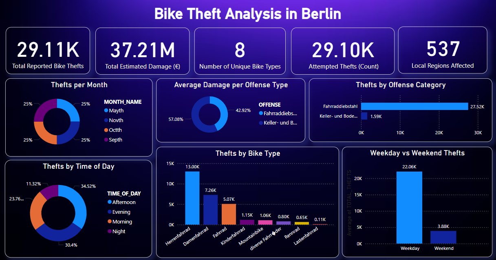

# 🚲 Berlin Bike Theft Analytics
A modern **data analytics pipeline** using **dbt**, **Snowflake**, and **Power BI** to analyze Berlin’s bike theft incidents with interactive insights.

## 📊 Power BI Dashboard

> Final dashboard showcasing KPIs and insights:



````markdown
---

## 📁 Project Structure

```plaintext
bikertheft/
├── models/
│   ├── staging/
│   │   ├── sources.yml
│   │   └── stg_bike_thefts.sql
│   ├── intermediate/
│   │   ├── int_bike_theft_day_category.sql
│   │   ├── int_bike_theft_time_of_day.sql
│   │   ├── int_bike_theft_damage_tier.sql
│   │   ├── int_bike_theft_severity_category.sql
│   │   └── int_bike_theft_enriched.sql
│   └── marts/
│       ├── mart_bike_theft_summary.sql
│       ├── mart_bike_theft_daily_summary.sql
│       └── mart_bike_theft_by_category.sql
````

---

## 🛠️ Tech Stack

* **Snowflake** → Cloud data warehouse for scalable storage and compute.
* **dbt** → Transformation layer for staging, enrichment, and marts.
* **Power BI** → Business Intelligence visualization.

---

## 📊 Data Flow

1. **Staging**: Cleans and standardizes raw bike theft data (`stg_bike_thefts`).
2. **Intermediate**: Adds derived fields like:

   * Day Category (Weekday/Weekend)
   * Time of Day (Morning/Afternoon/etc.)
   * Damage Tier (Low/Medium/High)
   * Theft Severity
3. **Marts**:

   * `mart_bike_theft_summary`: Full enriched dataset for BI.
   * `mart_bike_theft_daily_summary`: Aggregates by date for trend analysis.
   * `mart_bike_theft_by_category`: Aggregates by severity, type, and damage.
---

## 🚀 Running the Project

### 1️⃣ Setup Snowflake

* Load cleaned bike theft dataset into `THEFTS.THEFTSDATA`.

### 2️⃣ Configure dbt

* Set Snowflake credentials in `profiles.yml`
* Run transformations:

```bash
dbt run
```

### 3️⃣ Connect to Power BI

* Connect Snowflake to Power BI.
* Use `mart_bike_theft_summary` for visuals.

---

## 🧠 Insights Enabled

✅ Theft patterns across weekdays vs weekends
✅ Theft severity and time-of-day patterns
✅ Aggregated metrics for damage and reporting
✅ BI filters for interactive exploration

---

## 📌 KPIs in Dashboard

* **Total Locations Reported**
* **Average Damage (€)**
* **Distinct Bike Types**
* **Extreme Damage Cases**
* **Total Reported Thefts**

---

## 📜 License

MIT License – for educational and analytical purposes.

---

## 🙌 Contributors

Created by \[Your Name] 🚀

