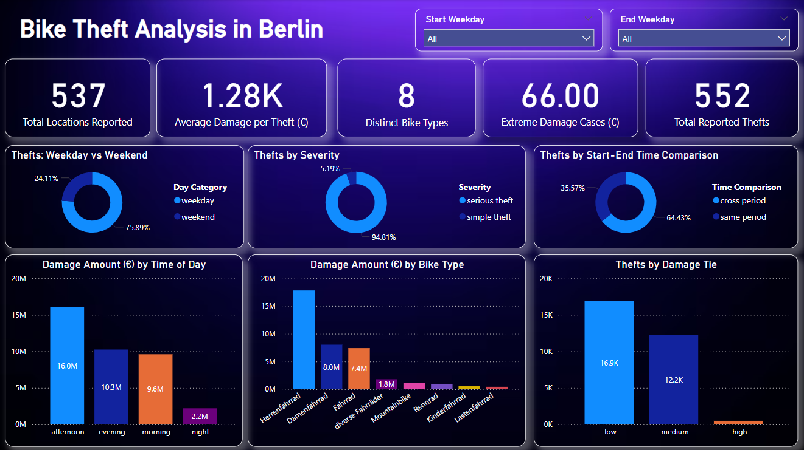

# 🚲 Berlin Bike Theft Analytics

A modern data pipeline to analyze and visualize bicycle theft incidents in Berlin using **dbt**, **Apache Airflow**, **Snowflake**, and **Power BI**.

This project transforms raw theft data into structured dimensional models, orchestrates the transformation with Airflow (using Cosmos), and provides actionable insights via a BI dashboard.

---
## 🖼️ Dashboard Screenshot

> 

## 📁 Project Structure

```bash
dbt-dag/
├── .astro/                         # Astronomer configs (if used)
├── dags/
│   ├── __pycache__/
│   ├── biketheft.py               # Airflow DAG (uses Cosmos dbt integration)
│   └── dbt/
│       └── berlinbiketheft/       # dbt project root
│           ├── analyses/
│           ├── logs/
│           ├── macros/
│           ├── models/
│           │   ├── marts/
│           │   │   ├── dimension/
│           │   │   ├── fact/
│           │   │   └── staging/
│           ├── seeds/
│           ├── snapshots/
│           ├── target/
│           ├── tests/
│           ├── dbt_project.yml
│           ├── packages.yml
│           └── README.md
├── .airflowignore
````

---

## 🔄 ETL Pipeline Overview

```text
        Raw CSV Files (Bike Theft)
               │
               ▼
     Staging Layer (dbt models)
               │
               ▼
  Dimension & Fact Tables (marts/)
               │
               ▼
 Airflow DAG (biketheft.py with Cosmos)
               │
               ▼
       Snowflake Warehouse
               │
               ▼
      Power BI Dashboard (Reports)
```

---

## 🧱 dbt Model Layers

* `staging/`: Clean & standardize raw data.
* `dimension/`: e.g., `dim_day_type`, `dim_bike_types`, `dim_datetime`
* `fact/`: `fact_bike_thefts`
* `aggregates/`: `thefts_by_day_type`, `thefts_by_time_of_day`

---

## 📊 Power BI Dashboard Metrics

| Metric                       
| ----------------------------- |
| **Total Thefts**              |
| **Total Damage Amount (€)**   |
| **Unique Bike Types**         |
| **Attempted Thefts**          |
| **Unique LOR Codes**          |
| **Most Common Offense**       |
| **Top Theft Time**            |
| **Top Bike Type**             | 
| **Weekday vs Weekend Thefts** | 

---

## ⚙️ Tech Stack

| Tool           | Purpose                          |
| -------------- | -------------------------------- |
| dbt            | Data modeling & transformation   |
| Apache Airflow | Pipeline orchestration           |
| Cosmos         | Seamless dbt-Airflow integration |
| Snowflake      | Cloud data warehouse             |
| Power BI       | Dashboard & visualization        |

---

## 🚀 How to Run the Project

1. **Clone the Repo**

   ```bash
   git clone https://github.com/your-username/berlin-bike-theft.git
   cd dbt-dag
   ```

2. **Start Airflow (with Astro or Docker)**

   ```bash
   astro dev start
   ```

3. **Trigger the DAG**

   * Visit `http://localhost:8080`
   * Trigger the DAG: `dbt_bike_theft_dag`

4. **Check Snowflake**

   * Query `berlinbiketheft.marts.*` models for fact/dim data

5. **Power BI Setup**

   * Connect to Snowflake
   * Load `fact_bike_thefts` and dimensions
   * Build visualizations (filters, slicers, KPIs)

---

## 📄 License

This project is licensed under the MIT License.

---

## 🙌 Author

Shehryar Saqib
*Data Engineering & Analytics Enthusiast*

[LinkedIn](https://linkedin.com/in/mujtaba-saqib) • [GitHub](https://github.com/mujtabasaqib19)

```

---

Let me know if you’d like this saved as a `README.md` file or if you want to customize the author links or repository URL.
```
